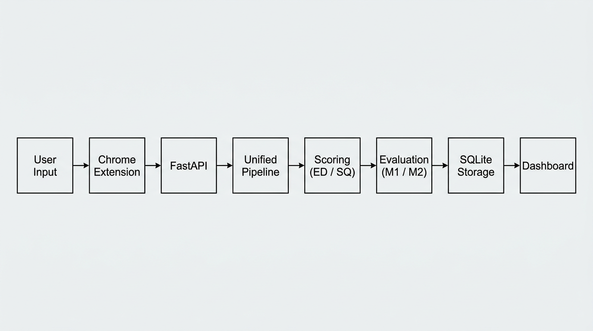

# Prompt Cognitive Health Pipeline

A system that evaluates user prompts (and model responses) for clarity and quality, scores them with **ED**, **SQ**, **M1**, and **M2**, and surfaces feedback in a browser extension and web dashboard.

## Problem Statement

Large language models respond to whatever users type. Vague, spam-like, or unstructured prompts lead to weak answers and poor learning outcomes. Teams need **consistent, explainable signals**—not a black box—so users can improve prompts before they send them.

## Solution Overview

This project ties together four pieces:

1. **Chrome extension** – Sends the current prompt to a local API and shows pass/fail-style feedback (decision, scores, reason, suggestion).
2. **FastAPI service** – One **`run_pipeline`** path: model inference → curation (**ED** / **SQ**) → **M1** / **M2** when accepted → optional SQLite logging.
3. **SQLite storage** – Persists runs for analytics.
4. **Dashboard** – Filters, charts, and recent runs over stored data.

The same pipeline logic runs everywhere (API and scripts), so behavior stays consistent.

## Features

- Real-time extension overlay on common chat UIs (debounced analyze calls).
- **Unified pipeline**: infer → `curate_text` (on model response) → M2 gate → metrics.
- **Dashboard**: time range and decision filters, Chart.js trends, M1/M2 in summaries.
- **Tests**: `pytest` for scoring, evaluation, and API (`tests/`).
- **Configurable** YAML (`configs/base.yaml`) for thresholds, keywords, and model settings.

## Architecture

High-level data flow:



1. **User input** is captured in the page.  
2. The **extension** POSTs `{ "text": "..." }` to **`/analyze`**.  
3. **FastAPI** calls **`run_pipeline`**.  
4. **Scoring** computes **ED** and **SQ** via `curate_text`.  
5. **Evaluation** computes **M1** and **M2** on accepted responses (before M2 threshold enforcement).  
6. Results are stored in **SQLite** and visible in the **dashboard** (`/dashboard`).

More detail: [docs/metrics.md](docs/metrics.md), [docs/comparison.md](docs/comparison.md).

## Tech Stack

| Layer        | Technology                          |
|-------------|--------------------------------------|
| API         | FastAPI, Uvicorn                     |
| Pipeline    | Python 3, shared `pipeline.py`       |
| Scoring     | scikit-learn (TF–IDF), custom rules  |
| Storage     | SQLite (`storage.py`)                |
| Dashboard   | Static HTML + Chart.js               |
| Extension   | Manifest V3, content script + popup  |
| Tests       | pytest, FastAPI `TestClient`        |
| Config      | PyYAML                               |

## Setup Instructions

### 1. Clone and environment

```bash
cd "Cognitive Health Pipeline"
python3 -m venv .venv
source .venv/bin/activate   # Windows: .venv\Scripts\activate
pip install -r requirements.txt
```

### 2. Configuration

- Edit **`configs/base.yaml`** for keywords, thresholds, and `model` (e.g. `gpt-4o-mini`).
- For live model calls, set **`OPENAI_API_KEY`** in your environment.

### 3. Chrome extension

1. Open `chrome://extensions`, enable **Developer mode**.
2. **Load unpacked** → select the **`chrome-extension`** folder.
3. In the extension popup, set **API base URL** (default `https://prompt-quality-analyzer.onrender.com`).

## How to Run

### API + dashboard

```bash
source .venv/bin/activate
uvicorn api_server:app --reload --host 0.0.0.0 --port 8000
```

- API root: `https://prompt-quality-analyzer.onrender.com`
- Dashboard: `https://prompt-quality-analyzer.onrender.com/dashboard`
- Stats: `GET /stats`, recent runs: `GET /recent`

### Extension

With the API running, open a supported chat page, type a prompt, pause briefly—the overlay shows the latest analysis.

### Tests

```bash
pytest
```

## Example Usage

**Analyze via HTTP:**

```bash
curl -s -X POST https://prompt-quality-analyzer.onrender.com/analyze \
  -H "Content-Type: application/json" \
  -d '{"text":"Explain how sleep helps memory in two steps with one example."}'
```

**Batch-style demo data:** see [data/demo_inputs.json](data/demo_inputs.json) and [data/demo_results.json](data/demo_results.json).

**Programmatic:**

```bash
python pipeline.py
```

Runs one sample through `run_pipeline` with `persist=False`.

## Screenshots

<!-- add screenshot here: extension UI — popup (API URL) and on-page overlay with decision, ED, SQ, reason, suggestion -->

<!-- add screenshot here: dashboard — header, filters, summary cards, trend charts, recent prompts list -->

## Future Improvements

- User accounts and cloud-hosted API.
- Per-domain extension UX presets; richer accessibility.
- Calibration studies for ED/SQ vs human ratings.
- Export dashboard reports (PDF/CSV) for coursework evidence.

## Project layout

```
docs/           # architecture diagram, metrics, before/after comparison
data/           # demo inputs and example results
tests/          # pytest suite
configs/        # YAML configuration
chrome-extension/
src/            # scoring & evaluation modules
```

## License / academic use

Suitable for coursework demonstration and viva; cite or adapt with attribution per your institution’s rules.
